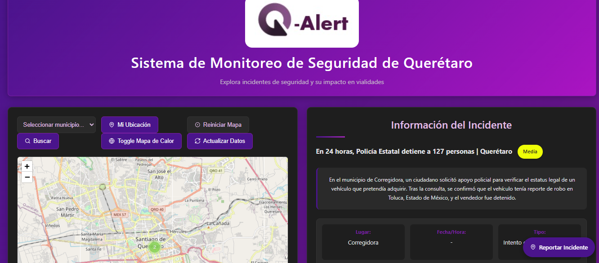
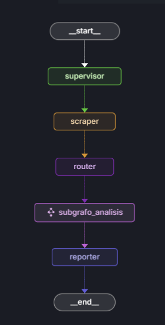
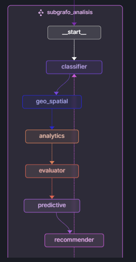

# QR-Alert: Sistema de Monitoreo de Seguridad para Querétaro

[![Demo de QR-Alert]](https://youtu.be/GB_Dr1jhNug "Demo de QR-Alert")

<p align="center">
  
</p>
<p align="center">
  
  
</p>

## 🌟 Descripción

QR-Alert es un sistema avanzado de monitoreo y alerta de seguridad diseñado específicamente para la ciudad de Querétaro. Utilizando inteligencia artificial y análisis de datos en tiempo real, QR-Alert recopila, procesa y visualiza información sobre incidentes de seguridad y situaciones que afectan las vialidades, permitiendo a los ciudadanos tomar decisiones informadas sobre sus desplazamientos.

## 🔍 Características principales

- **Mapa interactivo**: Visualización geoespacial de incidentes de seguridad con marcadores categorizados por tipo
- **Mapa de calor**: Identificación de zonas con mayor concentración de incidentes
- **Reportes ciudadanos**: Permite a los usuarios contribuir con información en tiempo real
- **Análisis de datos**: Procesamiento automático de noticias e incidentes mediante IA
- **Recomendaciones de rutas alternativas**: Sugerencias para evitar zonas afectadas
- **Estadísticas y tendencias**: Visualización de patrones de incidentes por tipo y ubicación
- **Notificaciones en tiempo real**: Alertas sobre nuevos incidentes relevantes
- **Interfaz adaptable**: Diseño responsive para dispositivos móviles y escritorio

## 🛠️ Tecnologías utilizadas

- **Backend**: Flask (Python)
- **Frontend**: HTML, CSS, JavaScript
- **Mapas**: Leaflet.js
- **Visualización de datos**: Chart.js
- **IA y procesamiento de lenguaje natural**: LangGraph con Gemini 2.0
- **Geocodificación**: OpenCage API
- **Análisis de noticias**: Tavily Search API

## 🚀 Instalación y despliegue

### Requisitos previos
- Python 3.10 o superior
- Docker (para despliegue en contenedores)
- API Keys para:
  - Google Gemini (GOOGLE_API_KEY)
  - OpenCage Geocoding (OPENCAGE_API_KEY)
  - Tavily Search (TAVILY_API_KEY)

### Instalación local

1. Clonar el repositorio:
```bash
git clone https://github.com/tu-usuario/qr-alert.git
cd qr-alert
```

2. Crear y activar entorno virtual:
```bash
python -m venv venv
source venv/bin/activate  # En Windows: venv\Scripts\activate
```

3. Instalar dependencias:
```bash
pip install -r requirements.txt
```

4. Configurar variables de entorno:
```bash
# Crear archivo .env en la raíz del proyecto
GOOGLE_API_KEY=tu_api_key_de_google
OPENCAGE_API_KEY=tu_api_key_de_opencage
TAVILY_API_KEY=tu_api_key_de_tavily
```

5. Ejecutar la aplicación:
```bash
python app.py
```


## 🔗 Enlaces

- [Demo de agentes](https://youtu.be/yScVSfOTcLc)
- [Demo en vivo](https://seguridad-production-ff55.up.railway.app/)


## 📄 Licencia

Este proyecto está licenciado bajo la licencia MIT
